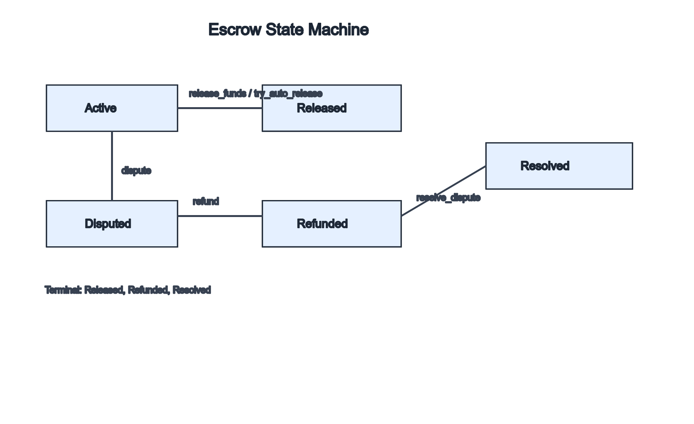

# Escrow State Machine Guide

This guide documents escrow lifecycle states, allowed transitions, and transition guards.

## State Machine Diagram

## States

- `Pending`: escrow created but funds not yet deposited (pre-funding)
- `Active`: funds locked; session in progress
- `Disputed`: an active escrow was challenged by a participant
- `Released`: funds released to final recipient
- `Refunded`: funds returned by admin flow
- `Resolved`: dispute resolution finalized

Terminal states:
- `Released`
- `Refunded`
- `Resolved`

## Valid Transitions

| From | To | Trigger | Condition |
|---|---|---|---|
| `Pending` | `Active` | `fund_escrow` | learner deposits funds |
| `Pending` | `Refunded` | `refund` | admin cancels before funding |
| `Active` | `Released` | `release_funds` | authorized release path |
| `Active` | `Released` | `try_auto_release` | `now >= session_end + auto_release_delay` |
| `Active` | `Disputed` | `dispute` | mentor/learner authorization |
| `Active` | `Refunded` | `refund` | admin path |
| `Disputed` | `Resolved` | `resolve_dispute` | admin/arbitration resolution |
| `Disputed` | `Refunded` | `refund` | admin refund from disputed state |

Invalid examples:
- `Released -> Active`
- `Refunded -> Active`
- `Resolved -> Disputed`
- `Active -> Pending`

## Transition Conditions

### `Pending -> Active`
- Learner deposits the required amount.
- Token transfer from learner to contract succeeds.

### `Active -> Released`
- Direct release: participant/admin authorization checks pass.
- Auto release: escrow timeout reached.

### `Active -> Disputed`
- Caller is a permitted party.
- Escrow not already terminal.

### `Active -> Refunded`
- Caller has admin permissions.
- Escrow still active.

### `Disputed -> Resolved`
- Admin/arbitration outcome submitted.
- Resolution timestamp recorded.

### `Disputed -> Refunded`
- Admin issues refund from disputed state.

## Lifecycle Examples

### Example 1: Happy Path
1. `create_escrow` creates `Pending`.
2. Learner funds escrow → transitions to `Active`.
3. Session completes successfully.
4. `release_funds` transitions to `Released`.

### Example 2: Timeout Auto Release
1. `create_escrow` creates `Pending`.
2. Learner funds → `Active`.
3. No manual release is submitted.
4. `try_auto_release` after delay transitions to `Released`.

### Example 3: Dispute and Resolution
1. `create_escrow` creates `Pending`.
2. Learner funds → `Active`.
3. `dispute` transitions to `Disputed`.
4. Evidence/arbitration process runs.
5. `resolve_dispute` transitions to `Resolved`.

## Verification Expectations

- Every state transition must be validated against the allowed matrix.
- Terminal states cannot transition back to non-terminal states.
- Invariant checks should execute after state-changing operations.
- The `StateMachine` trait in `contracts/shared/src/state_machine.rs` provides
  `EscrowStatus::is_valid_transition` for exhaustive validation.

Related documents:
- `contracts/escrow/INVARIANTS.md`
- `docs/state-machines.md`
