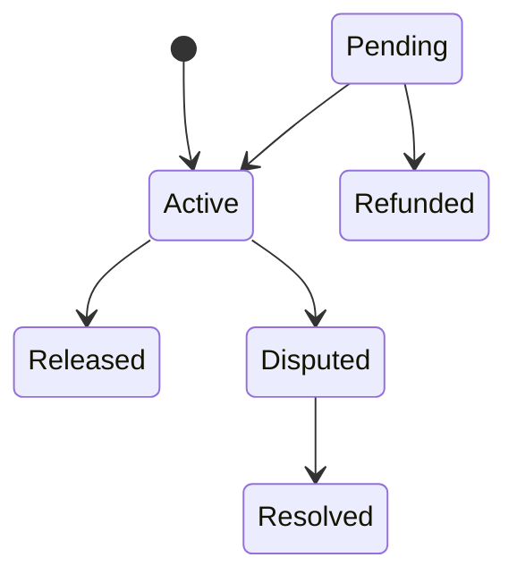

# Protocol State Transition Coverage Analyzer

## Overview

The Protocol State Transition Coverage Analyzer is a comprehensive tooling suite that measures and visualizes state transition coverage across protocol contracts. It identifies untested transitions, generates detailed coverage reports, and integrates seamlessly with CI/CD pipelines.

## Features

### 1. **State Transition Enumeration**
- Automatically discovers all defined state machines from contracts
- Enumerates valid transitions for each state machine
- Supports multiple state types (EscrowStatus, SubscriptionStatus, LoanStatus, ISAStatus, etc.)

### 2. **Coverage Analysis**
- Calculates per-state-machine coverage percentages
- Identifies untested valid transitions
- Computes overall protocol coverage metrics
- Distinguishes between valid and invalid transitions

### 3. **Report Generation**

#### JSON Report
Detailed machine-readable format suitable for parsing and integration:
```json
{
  "generated_at": "2026-06-16T03:14:39Z",
  "overall_coverage": 48.0,
  "state_machines": [
    {
      "state_machine": "EscrowStatus",
      "total_possible_transitions": 36,
      "valid_transitions": 7,
      "tested_transitions": 5,
      "coverage_percentage": 71.43,
      "untested_transitions": [
        ["Active", "Refunded"],
        ["Disputed", "Refunded"]
      ],
      "all_valid_transitions": [...]
    }
  ]
}
```

#### Markdown Report
Human-readable format with detailed transition matrices:
```markdown
# State Transition Coverage Analysis Report

## EscrowStatus

| Metric | Value |
|--------|-------|
| Total Possible Transitions | 36 |
| Valid Transitions | 7 |
| Tested Transitions | 5 |
| Coverage | 71.43% |

### Untested Transitions

- `Active` → `Refunded`
- `Disputed` → `Refunded`
```

#### Mermaid Diagrams
Visual state machine representations:


## Usage

### Quick Start

```bash
# Run the analyzer
cargo run --bin analyze-transitions --release

# Or use the CI script
bash scripts/analyze-state-transitions.sh
```

### Output

The analyzer generates reports in `analysis_output/`:
- `coverage_report.json` - Machine-readable coverage data
- `coverage_report.md` - Human-readable analysis
- `{state_machine}_diagram.mmd` - Mermaid diagrams for each state machine

### Example Output

```
🔍 Analyzing state machine transitions...

📊 EscrowStatus: 71.43% coverage (5/7)
📊 SubscriptionStatus: 33.33% coverage (3/9)
📊 LoanStatus: 50.00% coverage (2/4)
📊 ISAStatus: 40.00% coverage (2/5)

📈 Overall Coverage: 48.00% (12/25)

✅ JSON report written to analysis_output/coverage_report.json
✅ Markdown report written to analysis_output/coverage_report.md
✅ Diagram written to analysis_output/escrowstatus_diagram.mmd
```

## Integration

### CI/CD Pipeline

The analyzer integrates with GitHub Actions via `.github/workflows/state-transition-coverage.yml`:

**Triggers:**
- Push to main/develop
- Pull requests to main/develop
- Contract or test file changes

**Features:**
- Automatic report generation
- PR comments with coverage results
- Artifact upload (30-day retention)
- Configurable coverage thresholds

**Example PR Comment:**
```
## 📊 State Transition Coverage Analysis

**Overall Coverage**: 48.00%

### EscrowStatus
- Coverage: 71.43%
- Untested: Active → Refunded, Disputed → Refunded
```

### Manual CI Integration

```bash
# Run with coverage gate (fail if below threshold)
COVERAGE_GATE=50 bash scripts/analyze-state-transitions.sh
```

## Architecture

### Core Components

```
tools/
├── Cargo.toml
└── src/
    ├── lib.rs           # Core analysis engine
    │   ├── StateMachine struct
    │   ├── TransitionCoverageReport
    │   ├── ProtocolCoverageReport
    │   ├── analyze_coverage()
    │   ├── generate_mermaid_diagram()
    │   └── generate_markdown_report()
    └── main.rs          # CLI entry point
        ├── State machine definitions
        ├── Tested transition tracking
        └── Report generation
```

### State Machine Definition

Each state machine is defined with:
1. **Name** - Unique identifier (e.g., "EscrowStatus")
2. **States** - All possible states (e.g., Pending, Active, Released)
3. **Valid Transitions** - Allowed state transitions as (from, to) tuples

```rust
let escrow_sm = StateMachine::new(
    "EscrowStatus".to_string(),
    vec![
        "Pending".to_string(),
        "Active".to_string(),
        "Released".to_string(),
        "Disputed".to_string(),
        "Refunded".to_string(),
        "Resolved".to_string(),
    ],
    vec![
        ("Pending".to_string(), "Active".to_string()),
        ("Active".to_string(), "Released".to_string()),
        ("Active".to_string(), "Disputed".to_string()),
        // ... more transitions
    ],
);
```

### Coverage Calculation

```
Coverage % = (Tested Valid Transitions / Total Valid Transitions) × 100
```

Example:
- EscrowStatus has 7 valid transitions
- 5 are tested in existing test suite
- Coverage = (5/7) × 100 = 71.43%

## Supported State Machines

The analyzer automatically detects and analyzes:

| State Machine | States | Valid Transitions | Location |
|---------------|--------|-------------------|----------|
| EscrowStatus | 6 | 7 | `contracts/shared/src/state_machine.rs` |
| SubscriptionStatus | 6 | 9 | `contracts/shared/src/state_machine.rs` |
| LoanStatus | 5 | 4 | `contracts/shared/src/state_machine.rs` |
| ISAStatus | 6 | 5 | `contracts/shared/src/state_machine.rs` |

## Adding New State Machines

To analyze a new state machine:

1. **Define the state machine** in `contracts/shared/src/state_machine.rs`:
```rust
#[contracttype]
#[derive(Clone, Debug, Eq, PartialEq)]
pub enum MyStatus {
    State1,
    State2,
    State3,
}

impl StateMachine for MyStatus {
    type State = Self;
    fn is_valid_transition(_env: &Env, from: &Self::State, to: &Self::State) -> bool {
        matches!((from, to), /* ... */)
    }
}
```

2. **Register in analyzer** (`tools/src/main.rs`):
```rust
let my_sm = StateMachine::new(
    "MyStatus".to_string(),
    vec!["State1".to_string(), "State2".to_string(), "State3".to_string()],
    vec![
        ("State1".to_string(), "State2".to_string()),
        // ... transitions
    ],
);
state_machines.push(my_sm);
```

3. **Track tested transitions** in the same file:
```rust
// Add to tested_transitions set
tested_transitions.insert(("State1".to_string(), "State2".to_string()));
```

## Interpreting Results

### High Coverage (>80%)
✅ Most state transitions are tested. Focus on edge cases and untested paths.

### Medium Coverage (50-80%)
⚠️ Significant test gaps exist. Consider adding tests for:
- Untested state transitions
- Error conditions during transitions
- State machine invariants

### Low Coverage (<50%)
❌ Critical gaps in transition testing. This indicates:
- Missing test cases for valid transitions
- Potential for undetected bugs in state machine logic
- Risk of regression during upgrades

### All Transitions Tested (100%)
🎉 Complete coverage! Continue monitoring:
- New transitions added during upgrades
- State machine refactoring
- Contract evolution

## Troubleshooting

### Analyzer Won't Compile
```bash
# Ensure Rust is up to date
rustup update

# Clean and rebuild
cargo clean
cargo build -p state-transition-analyzer
```

### Missing State Machines
Verify the state machine is:
1. Defined in `contracts/shared/src/state_machine.rs`
2. Added to `tools/src/main.rs`
3. Implements the `StateMachine` trait

### Reports Not Generated
Check:
1. `analysis_output/` directory exists and is writable
2. No file permission errors
3. Sufficient disk space

## Performance

- **Analysis time**: ~1-5 seconds for full protocol
- **Memory usage**: <100MB
- **Report size**: ~50KB JSON, ~20KB Markdown
- **Suitable for**: CI/CD (every push/PR), local development

## Future Enhancements

- [ ] Temporal coverage tracking (coverage trends)
- [ ] Test suggestion generation
- [ ] Missing transition warnings
- [ ] State invariant validation
- [ ] Multi-version analysis (upgrade safety)
- [ ] Interactive web dashboard

## Related Documentation

- [State Machine Specification](../docs/state-machines.md)
- [State Machine Guide](../docs/STATE_MACHINE.md)
- [Escrow Invariants](../contracts/escrow/INVARIANTS.md)
- [Architecture Documentation](../ARCHITECTURE.md)
